# Football Betting Market Prediction

This project is a standalone machine learning pipeline for predicting football
betting markets from historical match statistics. It focuses on practical ML
craft: data cleaning, leakage-safe feature engineering, temporal
train/validation/test evaluation, probability calibration, threshold tuning,
model diagnostics, and reusable prediction artifacts.

The models do not use betting odds. They learn only from scraped match data and
pre-match team history.

## Model Groups

Rather than one model per betting market, the project builds **four core model
groups** and derives most markets from them:

| Notebook | Model group | Core prediction | Markets it produces |
|---|---|---|---|
| `notebooks/1x2_pred.ipynb` | Match outcome | H/D/A probabilities + either-half classifiers | 1X2, team to win either half |
| `notebooks/goals_pred.ipynb` | Full-time goals | Expected goals per side to Dixon-Coles score grid | Goal over 0.5-3.5, team goal overs, goal ranges, G/G (BTTS), grid-derived 1X2 |
| `notebooks/first_half_goals_pred.ipynb` | First-half goals | Expected 1H goals per side to 1H score grid (+ companion 2H model) | 1H over 0.5/1.5/2.5, 1H BTTS, 1H 1X2, derived win-either-half |
| `notebooks/corners_pred.ipynb` | Corners | Expected corners per side to NB2 count distributions | Total corners over 7.5-10.5, team total corners |

The goals-based groups follow the count-model philosophy: fit expected counts
first (constant baseline to Poisson GLM to XGBoost `count:poisson`, selected on
validation), turn them into full probability distributions (Dixon-Coles-adjusted
score grids for goals, Negative-Binomial convolutions for overdispersed
corners), then read every over/under, range, BTTS, and 1X2 market off the
distribution instead of training one classifier per line. Direct per-line
classifiers are trained only as benchmarks.

Each notebook ends with a Platt-calibration step, a per-market decision layer
with validation-tuned probability thresholds (precision-max subject to a 15%
coverage floor), a `predict_fixture` interface for unplayed fixtures, and a
self-contained joblib artifact.

## Shared Code: `src/football_prediction`

The notebooks share a small package imported through a `sys.path` bootstrap cell,
so no install step is required:

```text
src/football_prediction/
  core/
    config.py          shared windows, Elo settings, split dates, paths
  data/
    loading.py         CSV loading, required-column filtering, team filtering
    targets.py         target derivation, including 2H = FT - HT
  features/
    rolling.py         team-perspective rows, leakage-safe rolling form, H2H
    elo.py             sequential Elo with margin-of-victory multiplier
    state.py           team-state store for pre-kickoff fixture features
  modeling/
    calibration.py     Platt calibrators and reliability tables
    metrics.py         count metrics, per-market metrics, RPS
  markets/
    goals.py           score grids, Dixon-Coles rho, goal-market probabilities
    corners.py         NB2 and Poisson corner PMFs, total-corner convolution
    derivation.py      small shared market-derivation utilities
```

All four notebooks share identical split dates from
`football_prediction.core.config`, so
cross-model comparisons (grid-derived 1X2 vs the dedicated classifier, derived
vs direct either-half) are apples-to-apples. `1x2_pred.ipynb` now uses the same
helpers as the other notebooks.

## The 1X2 Notebook (Model Group 1)

`notebooks/1x2_pred.ipynb` trains three XGBoost classifiers:

- A multiclass 1X2 model for `home_win`, `draw`, and `away_win`
- A binary model for `home_wins_either_half`
- A binary model for `away_wins_either_half`

The final decision layer returns one of:

- `home`
- `away`
- `home win either half`
- `away win either half`
- `skip`

`skip` is intentional. The pipeline abstains when calibrated probabilities do
not clear validation-tuned thresholds. In the current saved notebook output,
the selected thresholds are:

| Threshold | Value |
|---|---:|
| Minimum outright probability | 0.70 |
| Minimum outright margin | 0.10 |
| Minimum either-half probability | 0.75 |

## Data

The dataset contains rich match statistics across eight competitions:

- Premier League
- La Liga
- Serie A
- Ligue 1
- Bundesliga
- UEFA Champions League
- UEFA Europa League
- UEFA Conference League

The data was scraped from Flashscore. The Apify actor used for scraping is
available here:
[Edehisaboi/Flashscore-Football-Match-Stats-Scraper](https://github.com/Edehisaboi/Flashscore-Football-Match-Stats-Scraper.git)

The modeling dataset is stored at:

```text
datasets/rich_stats/league_matches_stats.csv
```

## Pipeline

```mermaid
flowchart LR
    A["Flashscore match stats"] --> B["Clean required columns"]
    B --> C["Remove low-history teams"]
    C --> D["Build leakage-safe rolling features"]
    D --> E["Temporal train/validation/test split"]
    E --> F["Train regularised XGBoost models"]
    F --> G["Platt-calibrate probabilities"]
    G --> H["Tune decision thresholds on validation"]
    H --> I["Score held-out test window"]
    I --> J["Save reusable joblib artifact"]
```



Key implementation choices:

- Multi-competition dataset rather than a Premier League-only model
- Three-way temporal split: training before 2025-07-01, validation before
  2026-01-01, and held-out test fixtures from 2026-01-01 onward
- Validation window used for early stopping, the small hyperparameter sweep,
  Platt calibration, and decision-threshold tuning
- Test window scored once at the end for the final read-out
- Rolling features use previous matches only, reducing data leakage
- Expected-goals and head-to-head features are missing-tolerant, so older rows
  and teams with no prior meeting can still be modeled
- Unknown teams are rejected during fixture prediction
- Odds are excluded so the model remains a standalone prediction system

## Features

The current model uses 30 pre-match features: 22 core features that must be
present and 8 missing-tolerant features handled natively by XGBoost.

Feature groups include:

- Elo difference plus both teams' absolute Elo levels
- Short-form points, goals, goal difference, attack-vs-defence, shots on target,
  conceded shot pressure, shot accuracy, corners, possession, and fouls
- Venue form for home and away points
- Medium-form points and goal-difference gaps over a longer horizon
- Rest-days difference, capped so off-season gaps do not dominate
- European cup context
- Head-to-head match count, home-team win rate, and home-team goal difference
- Expected-goals form and finishing luck, where xG data is available

## Evaluation

The notebook evaluates probability quality, class behavior, calibration,
feature importance, and the tuned decision layer.

Current saved notebook output:

| Split | Rows | Date range |
|---|---:|---|
| Training | 10,072 | 2020-11-05 to 2025-05-31 |
| Validation | 1,251 | 2025-07-08 to 2025-12-30 |
| Test | 1,152 | 2026-01-01 to 2026-05-30 |

1X2 test comparison:

| Model | Accuracy | Log loss |
|---|---:|---:|
| Class frequency | 43.92% | 1.0708 |
| Elo-only logistic regression | 50.35% | 1.0170 |
| XGBoost raw | 50.52% | 1.0088 |
| XGBoost calibrated | 51.13% | 1.0165 |

Either-half test metrics using calibrated probabilities with a 0.5 cut:

| Target | Accuracy | Log loss |
|---|---:|---:|
| Home wins either half | 63.89% | 0.6357 |
| Away wins either half | 61.89% | 0.6732 |

Decision layer on the test set with validation-tuned thresholds:

| Decision | Picks | Coverage | Precision |
|---|---:|---:|---:|
| home | 204 | 17.7% | 68.6% |
| away | 13 | 1.1% | 76.9% |
| home win either half | 59 | 5.1% | 72.9% |
| away win either half | 28 | 2.4% | 67.9% |
| combined slate | 304 | 26.4% | 69.7% |
| skip | 848 | 73.6% | n/a |

## Derived-Market Notebooks: Saved Results

All figures below are from the held-out test window (1,152 matches,
2026-01-01 to 2026-05-30), scored once.

### Full-time goals (`goals_pred.ipynb`)

The Poisson GLM narrowly beat XGBoost `count:poisson` on validation deviance and
was selected as the mean model, with a Dixon-Coles rho of -0.031 fitted on
training scores. The score grid prices the goal markets close to their empirical
rates (for example Over 2.5: mean predicted 0.53 vs empirical 0.55; log loss
0.683). The grid-derived 1X2 slightly outperforms the dedicated calibrated 1X2
classifier on the shared test matches:

| Model | Accuracy | Log loss |
|---|---:|---:|
| Dedicated 1X2 classifier (calibrated) | 51.1% | 1.0165 |
| Goals-grid derived 1X2 | 50.3% | 1.0130 |

Decision layer highlight: Over 1.5 goals at the tuned 0.75 threshold produced
464 test picks (40% coverage) at 80.8% precision.

### First-half goals (`first_half_goals_pred.ipynb`)

Same ladder on half-time scores (Poisson GLM selected again). 1H over 0.5 prices
at 0.70 mean predicted vs 0.72 empirical (log loss 0.592). The headline result
is the win-either-half cross-check: probabilities **derived** from the 1H and 2H
score grids beat the direct binary classifiers on test log loss for both sides,
supporting the derive-from-half-goal-models route:

| Target | Direct classifier | Derived from half grids |
|---|---:|---:|
| Home wins either half | 0.6357 | 0.6337 |
| Away wins either half | 0.6732 | 0.6644 |

1H over 2.5 is reported uncalibrated by design (~12% positive rate leaves too
few validation positives for a stable calibrator).

### Corners (`corners_pred.ipynb`)

Corners are confirmed overdispersed (per-side variance/mean about 1.6), so
markets come from NB2 count distributions - means from XGBoost
`count:poisson` (which beat the must-beat rolling-mean baseline, validation MAE
2.26 vs 2.49, and the NegBin GLM), dispersion fitted on training residuals -
convolved across the two sides. The NB2 shape beats a plain Poisson at the same
means on validation log-score. Total over 9.5 prices at 0.47 mean predicted vs
0.49 empirical on test (log loss 0.688). Known limitation recorded in the
notebook: per-side residuals correlate at about -0.20, while the convolution
assumes independence.

## How To Run

Install dependencies:

```bash
pip install -r requirements.txt
```

Open and run the notebooks (run `1x2_pred.ipynb` first - the goals and
first-half notebooks compare against its saved artifact):

```text
notebooks/1x2_pred.ipynb
notebooks/goals_pred.ipynb
notebooks/first_half_goals_pred.ipynb
notebooks/corners_pred.ipynb
```

Each notebook saves its trained artifact to:

```text
models/match_1x2_pred.joblib
models/goals_pred.joblib
models/first_half_goals_pred.joblib
models/corners_pred.joblib
```

The notebooks work whether Jupyter is started from the repo root or from
`notebooks/` - a bootstrap cell resolves the project root and adds `src/` to
the import path.

## Limitations And Next Steps

The current implementation already includes probability calibration and
validation-tuned decision thresholds. Remaining limitations are mostly about
generalisation and coverage: the saved test metrics show weak draw recall, the
decision layers are intentionally selective, xG coverage starts in 2023, and
the newer chance-creation and crossing columns (big chances, shots inside the
box, crosses, touches in the box) only exist from the 2024-2025 season, so they
ride the NaN-tolerant feature path.

The derived-market models carry their own stated assumptions: the win-either-half
derivation treats the two halves as independent, and the total-corners
convolution treats the two sides as independent despite a mildly negative
residual correlation.

Useful next work would include rolling backtests across multiple seasons,
draw-aware modeling or target design, competition-specific calibration checks,
a bivariate corner model (copula or shared-factor) to replace the independence
assumption, and a stricter review of threshold stability. The project should
not be treated as betting advice.
