# Football Match Outcome Prediction

This project is a standalone machine learning pipeline for predicting football
match outcomes from historical match statistics. It focuses on practical ML
craft: data cleaning, leakage-safe feature engineering, temporal
train/validation/test evaluation, probability calibration, threshold tuning,
model diagnostics, and a reusable prediction artifact.

The model does not use betting odds. It learns only from scraped match data and
pre-match team history.

## What It Predicts

The notebook trains three XGBoost classifiers:

- A multiclass 1X2 model for `home_win`, `draw`, and `away_win`
- A binary model for `home_wins_either_half`
- A binary model for `away_wins_either_half`

The final decision layer returns one of:

- `home`
- `away`
- `home win either half`
- `away win either half`
- `skip`

`skip` is intentional. The pipeline abstains when calibrated probabilities do
not clear validation-tuned thresholds. In the current saved notebook output,
the selected thresholds are:

| Threshold | Value |
|---|---:|
| Minimum outright probability | 0.70 |
| Minimum outright margin | 0.10 |
| Minimum either-half probability | 0.75 |

## Data

The dataset contains rich match statistics across eight competitions:

- Premier League
- La Liga
- Serie A
- Ligue 1
- Bundesliga
- UEFA Champions League
- UEFA Europa League
- UEFA Conference League

The data was scraped from Flashscore. The Apify actor used for scraping is
available here:
[Edehisaboi/Flashscore-Football-Match-Stats-Scraper](https://github.com/Edehisaboi/Flashscore-Football-Match-Stats-Scraper.git)

The modeling dataset is stored at:

```text
datasets/rich_stats/league_matches_stats.csv
```

## Pipeline

```mermaid
flowchart LR
    A["Flashscore match stats"] --> B["Clean required columns"]
    B --> C["Remove low-history teams"]
    C --> D["Build leakage-safe rolling features"]
    D --> E["Temporal train/validation/test split"]
    E --> F["Train regularised XGBoost models"]
    F --> G["Platt-calibrate probabilities"]
    G --> H["Tune decision thresholds on validation"]
    H --> I["Score held-out test window"]
    I --> J["Save reusable joblib artifact"]
```



Key implementation choices:

- Multi-competition dataset rather than a Premier League-only model
- Three-way temporal split: training before 2025-07-01, validation before
  2026-01-01, and held-out test fixtures from 2026-01-01 onward
- Validation window used for early stopping, the small hyperparameter sweep,
  Platt calibration, and decision-threshold tuning
- Test window scored once at the end for the final read-out
- Rolling features use previous matches only, reducing data leakage
- Expected-goals and head-to-head features are missing-tolerant, so older rows
  and teams with no prior meeting can still be modeled
- Unknown teams are rejected during fixture prediction
- Odds are excluded so the model remains a standalone prediction system

## Features

The current model uses 30 pre-match features: 22 core features that must be
present and 8 missing-tolerant features handled natively by XGBoost.

Feature groups include:

- Elo difference plus both teams' absolute Elo levels
- Short-form points, goals, goal difference, attack-vs-defence, shots on target,
  conceded shot pressure, shot accuracy, corners, possession, and fouls
- Venue form for home and away points
- Medium-form points and goal-difference gaps over a longer horizon
- Rest-days difference, capped so off-season gaps do not dominate
- European cup context
- Head-to-head match count, home-team win rate, and home-team goal difference
- Expected-goals form and finishing luck, where xG data is available

## Evaluation

The notebook evaluates probability quality, class behavior, calibration,
feature importance, and the tuned decision layer.

Current saved notebook output:

| Split | Rows | Date range |
|---|---:|---|
| Training | 10,072 | 2020-11-05 to 2025-05-31 |
| Validation | 1,251 | 2025-07-08 to 2025-12-30 |
| Test | 1,152 | 2026-01-01 to 2026-05-30 |

1X2 test comparison:

| Model | Accuracy | Log loss |
|---|---:|---:|
| Class frequency | 43.92% | 1.0708 |
| Elo-only logistic regression | 50.35% | 1.0170 |
| XGBoost raw | 50.52% | 1.0088 |
| XGBoost calibrated | 51.13% | 1.0165 |

Either-half test metrics using calibrated probabilities with a 0.5 cut:

| Target | Accuracy | Log loss |
|---|---:|---:|
| Home wins either half | 63.89% | 0.6357 |
| Away wins either half | 61.89% | 0.6732 |

Decision layer on the test set with validation-tuned thresholds:

| Decision | Picks | Coverage | Precision |
|---|---:|---:|---:|
| home | 204 | 17.7% | 68.6% |
| away | 13 | 1.1% | 76.9% |
| home win either half | 59 | 5.1% | 72.9% |
| away win either half | 28 | 2.4% | 67.9% |
| combined slate | 304 | 26.4% | 69.7% |
| skip | 848 | 73.6% | n/a |

## How To Run

Install dependencies:

```bash
pip install -r requirements.txt
```

Open and run:

```text
notebooks/1x2_pred.ipynb
```

The notebook saves the trained artifact to:

```text
models/match_1x2_pred.joblib
```

## Why This Project Matters

This project is built to demonstrate hands-on ML engineering ability, not just
model fitting. It shows the full loop:

- cleaning imperfect scraped data
- handling low-history entities
- designing leakage-aware rolling features
- training multiple target types
- checking baselines, log loss, calibration, and class behavior
- converting calibrated probabilities into usable decisions
- saving and reloading a production-style artifact

## Limitations And Next Steps

The current implementation already includes probability calibration and
validation-tuned decision thresholds. Remaining limitations are mostly about
generalisation and coverage: the saved test metrics show weak draw recall, the
decision layer is intentionally selective, and xG coverage starts in 2023.

Useful next work would include rolling backtests across multiple seasons,
draw-aware modeling or target design, competition-specific calibration checks,
and a stricter review of threshold stability. The project should not be treated
as betting advice.
