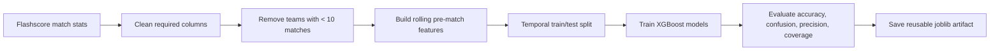

# Football Match Outcome Prediction

This project is a standalone machine learning pipeline for predicting football
match outcomes from historical match statistics. It focuses on practical ML
craft: data cleaning, leakage-safe feature engineering, temporal train/test
evaluation, model diagnostics, and a reusable prediction artifact.

The model does not use betting odds. It learns only from scraped match data and
pre-match team history.

## What It Predicts

The notebook trains three XGBoost classifiers:

- A multiclass 1X2 model for `home_win`, `draw`, and `away_win`
- A binary model for `home_wins_either_half`
- A binary model for `away_wins_either_half`

The final decision layer returns one of:

- `home`
- `away`
- `home win either half`
- `away win either half`
- `skip`

`skip` is intentional. The pipeline abstains when probabilities do not clear
the hardcoded confidence thresholds.

## Data

The dataset contains rich match statistics across eight competitions:

- Premier League
- La Liga
- Serie A
- Ligue 1
- Bundesliga
- UEFA Champions League
- UEFA Europa League
- UEFA Conference League

The data was scraped from Flashscore. The Apify actor used for scraping is
available here:
[Edehisaboi/Flashscore-Football-Match-Stats-Scraper](https://github.com/Edehisaboi/Flashscore-Football-Match-Stats-Scraper.git)

The modeling dataset is stored at:

```text
datasets/rich_stats/league_matches_stats.csv
```

## Pipeline



Key implementation choices:

- Multi-competition dataset rather than a Premier League-only model
- Temporal split so future fixtures are tested after past fixtures
- Rolling features use previous matches only, reducing data leakage
- Low-history teams are filtered out before modeling
- Unknown teams are rejected during fixture prediction
- Odds are excluded so the model remains a standalone prediction system

## Features

The model uses sixteen pre-match features, including:

- Elo difference
- Recent home and away points form
- Recent goals scored and conceded
- Attack-vs-defence form gaps
- Shots-on-target form
- Corners form
- Rest-days difference
- Shot accuracy, possession, fouls, and conceded-shot pressure

## Evaluation

The notebook includes a compact evaluation section with:

- Train vs test accuracy table
- Train/test generalisation gap chart
- Row-normalised 1X2 confusion matrix
- Class-level precision, recall, and F1 metrics
- Either-half positive-class metrics
- 1X2 feature-importance chart
- Decision precision and coverage charts

Latest test run:

| Target | Test accuracy |
|---|---:|
| 1X2 match result | 48.88% |
| Home wins either half | 62.00% |
| Away wins either half | 57.08% |

Latest decision layer:

| Decision | Picks | Precision |
|---|---:|---:|
| home | 249 | 66.67% |
| away | 101 | 53.47% |
| home win either half | 161 | 60.87% |
| away win either half | 116 | 55.17% |
| combined slate | 627 | 60.93% |

Skip rate: 45.85%

## How To Run

Install dependencies:

```bash
pip install -r requirements.txt
```

Open and run:

```text
notebooks/1x2_pred.ipynb
```

The notebook saves the trained artifact to:

```text
models/match_1x2_pred.joblib
```

## Why This Project Matters

This project is built to demonstrate hands-on ML engineering ability, not just
model fitting. It shows the full loop:

- cleaning imperfect scraped data
- handling low-history entities
- designing leakage-aware rolling features
- training multiple target types
- evaluating overfitting and class behavior
- converting probabilities into usable decisions
- saving and reloading a production-style artifact

## Limitations And Next Steps

The current model still shows a clear train/test gap, so the next improvements
would be probability calibration, rolling backtests across multiple seasons,
target-specific threshold review, and more conservative XGBoost regularisation.
The project should not be treated as betting advice.
